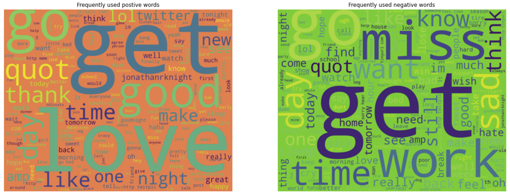
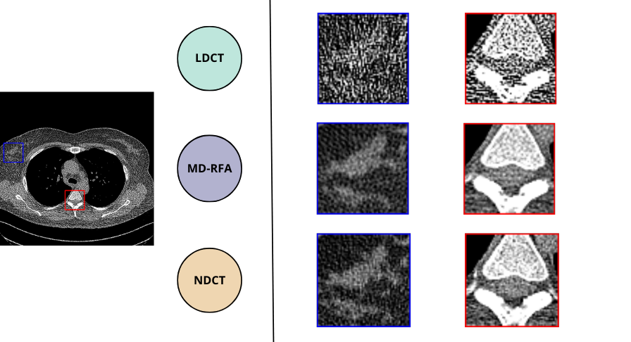
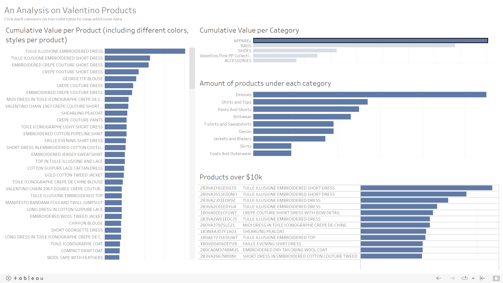
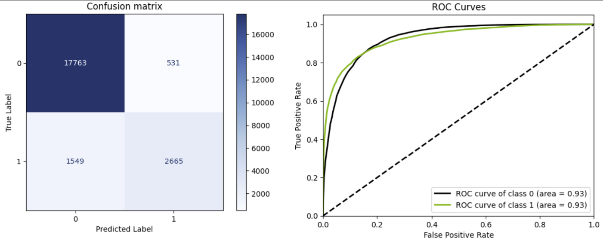

## Selected projects in Data Science, Machine Learning, NLP and Computer Vision

---

### Text-Classification for Sentimental Analysis
This project involves building a text classification model for sentiment analysis. The model will be trained on a dataset of reviews and will classify the sentiment as positive, negative, or neutral. It will use various features and preprocessing techniques to make accurate predictions. This model can be deployed in various applications like customer service, social media analysis, and market research.

<figure>
    
    <figcaption>Dataset analysis: A word cloud to visualize most frequently use negative and positive words.</figcaption>
</figure>

    
    
    
    
    

[View code on GitHub](https://github.com/kevinmfreire/meaningful_words)
 
[Try out my Demo](https://kevinmfreire-meaningful-words-st-app-q4hiuc.streamlit.app/#demo)

---

### [Enhancing Low Dose CT Scan Image Quality Using Deep Learning](./pages/md-rfa.md)
This project aims to develop a deep learning model that improves the image quality of low dose CT scans. The model will be trained on a large dataset of low and high dose CT scans and will use techniques such as CNNs, GANs, and image super-resolution to enhance the resolution, sharpness, and contrast of low dose CT scans. By doing so, the model can reduce radiation exposure for patients undergoing CT scans while providing high-quality images for diagnosis and treatment. The effectiveness of the model will be evaluated on a separate dataset of low dose CT scans, and the results will demonstrate its potential in medical imaging.

<figure>
    
    <figcaption>Sample result of Chest dataset comparing Low Dose and Normal Dose CT Scan, and MD-RFA DNN.</figcaption>
</figure>

<!--  -->

    
    
    
    
    

[View code on GitHub](https://github.com/kevinmfreire/MD-RFA-Net)

---

### Automated Web Scraping and Entity Extraction from News Articles using Spacy and Python
In this project, I aim to develop a web scraping script that utilizes Spacy's pre-trained model and Python to extract and store specific content from news articles. The script will identify and extract the names of people, places, and organizations from the article's text and store them in a database. By automating this process, we can quickly and efficiently extract valuable information from a large volume of news articles. The resulting database will enable us to perform further analysis and gain insights into the prevalence and distribution of specific entities within the news media.

    
    
    
    
    
    

[View code on GitHub](https://github.com/kevinmfreire/wheres_waldo)

---

### Valentino Website Product Extraction and Analysis using Python, Beautiful Soup, Selenium, Pandas, and Tableau
This project involves using Python, Beautiful Soup, Selenium, and Pandas to extract product information from the Valentino website. We will extract data such as product names, prices, descriptions, sizes, colors, and images, and then perform data analysis using pandas and matplotlib to gain insights into the trends and patterns of the products. Additionally, I use Tableau to create interactive visualizations to further explore and analyze the data. This project showcases the power of web scraping and data analysis using Python and its libraries, as well as the ability to present findings using Tableau.

    
    
    
    

[View code on GitHub](https://github.com/kevinmfreire/mi-valentino)
 
[View Dashboard on Tableau](https://public.tableau.com/app/profile/kevin.freire/viz/ValentinoProductAnalysis/ValentinoProductAnalysis?publish=yes)

---

### Flight Delay Prediction using Python, Scikit-learn, Seaborn, Matplotlib and SMOTE Technique
This project involves using Python, scikit-learn, seaborn, and matplotlib to develop a predictive model for determining the probability of delay for a scheduled flight. I solved the issue of imbalanced datasets using the SMOTE technique. The model has numerous applications, from optimizing airline schedules to helping travelers make informed travel plans.

<figure>
    
    <figcaption>Confusion matrix (left), ROC Curve (right) performance analysis for Random Forrest Classifier.</figcaption>
</figure>

    
    
    
    
    

[View code on GitHub](https://github.com/kevinmfreire/SCL_delays)
 
[View code on Colab](https://colab.research.google.com/github/kevinmfreire/SCL_delays/blob/main/notebook/solution.ipynb)

---

### Revolutionizing Autonomous Racing: Reinforcement Learning for High-Performance Vehicle Control
This project aims to train a virtual vehicle to race on a challenging track using reinforcement learning techniques. The vehicle will be trained using a custom fine-tuned AWS Deep Learning architecture to achieve optimal performance. After training, an A/B test will be performed between the custom model and an AWS pre-trained model to determine the effectiveness of our approach. This project has the potential to revolutionize the field of autonomous vehicle technology and improve racing performance.

    
    
    
    

[View code on GitHub](https://github.com/kevinmfreire/DeepRacer-Freire)

### Implementing Height Sensing System for Lunar Lander: Enabling Canada's First Soft Landing on the Moon
The project involves the implementation of the Height Sensing System (HSS) for a Lunar Lander. The HSS subsystem will engage during the last 50 meters of the descent towards the lunar surface to determine the spacecraft altitude and signal to other subsystems when the spacecraft has landed. The spacecraft has a laser altimeter sensor that is used to compute the height of the spacecraft, and the HSS will read the raw altimeter measurements and calculate the height. The project will require working with the complex Lander flight software, which enables all subsystems to execute in a distributed context, with communication through a message bus called MoonWire. The project will involve understanding and adhering to the MoonWires specification to ensure proper communication between subsystems. The ultimate goal of the project is to enable the first Canadian-led soft landing on the moon.

    
    

[View code on GitHub](https://github.com/kevinmfreire/project_skyfall)
