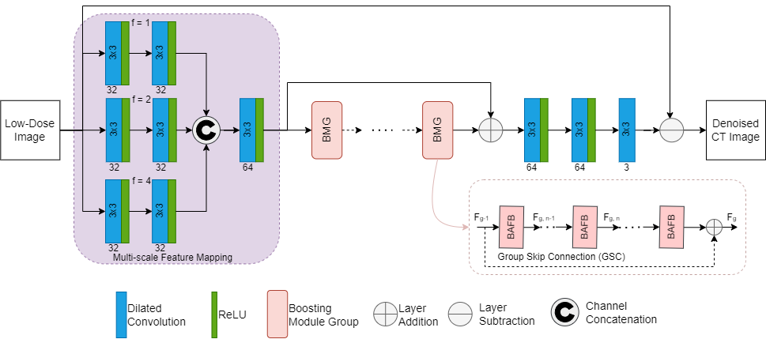
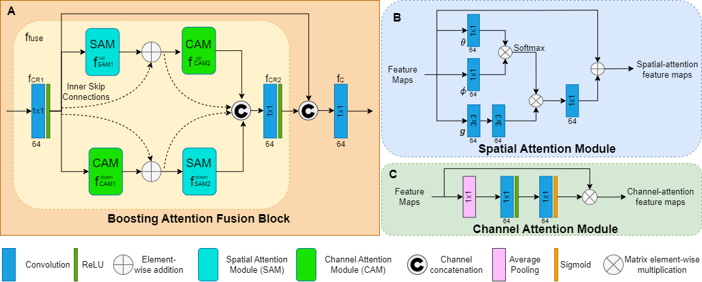
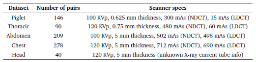
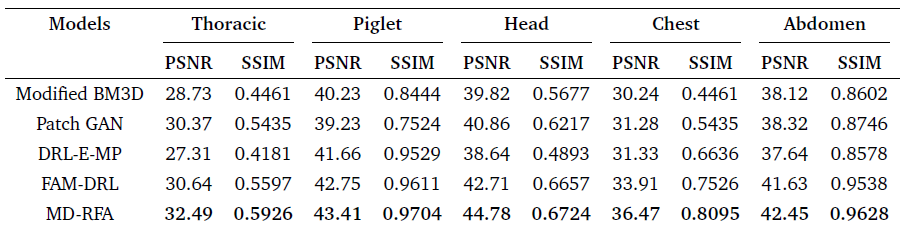
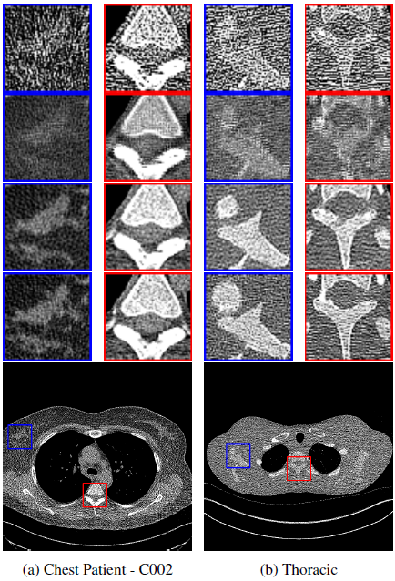

## MULTI-SCALE DILATION WITH RESIDUAL FUSED ATTENTION NETWORK FOR LOW DOSE CT NOISE ARTIFACT REDUCTIONS
---

### Introduction

Computed Tomography (CT) scans produce more than half the radiation exposure from medical use which result in problems for long term use of these expensive machines.  Some solutions have involved reducing the radiation dose, however that leads to noise artifacts making the low dose CT (LDCT) images unreliable for diagnosis.  In this study, a Multi-scale Dilation with Residual Fused Attention (MD-RFA) deep neural network is proposed, more specifically a network with an integration with a Multi-scale feature mapping, spatial- and channel-attention module to enhance the quality of LDCT images.  Further, the multi-scale image mapping uses a series of dilated convolution layers, which promotes the model to capture hierarchy features of different scales.  The attention modules are combined in a parallel connection and are described as a boosting attention fusion block (BAFB) that are then stacked on top of one another creating a residual connection known as a boosting Module group (BMG).

### Objective
* Propose a novel deep learning algorithm utilizing the BMG from [1] and Multi-scale Feature Mapping from [6].
* Utilize the ResNet50 V2 pre-trained Network for for improved Perceptual Loss.

### Methodology - Proposed Model
* A deep learning network, MD-RFA, shown in **Figure 1**, is proposed for reducing noise artifacts found in LDCT images.
* The proposed denoising network consists of dilated convolution layers that use different dilation rates to capture features of different scales.
* The next section of the network is the multi-dimensional deep features in the cascade BMG. Within each BMG, a stack of N BAFB contain the fusion of the spatial and channel attention modules (Figure 2A).
* Spatial Attention module (Figure 2B) captures non-local long-range dependencies.
* Channel Attention module (Figure 2C) utilizes average pooling to permit a small invariance for extracting features and a sigmoid activation function for capturing nonlinearities.
* Finally, It uses a series of dilated convolution layers two of which are used to recover the features of the noise artifacts component and the last is used to reconstruct the learned noise artifacts.
* Two skip connections, the first larger one subtracts the input image with the learned noise artifacts and the second performs identify mapping.
* Network was optimized using three different loss functions:
    * **Perceptual Loss:** Allows the model to learn the feature distribution of NDCT images from the feature space, which is done by utilizing the ResNet50 V2 pre-trained network.
    * **Mean Squared Error (MSE) Loss:** Calculates the difference between each pixel of the generated and ground truth image.
    * **Structural Dissimilarity (DSIM) Loss:** Used for comparing the structural information between the generated and ground truth images.

<figure>
    
    <figcaption>Figure 1: Multi-scale Dilation with Residual Fused Attention (MD-RFA) Network Architecture.</figcaption>
</figure>
 
<figure>
    
    <figcaption>Figure 2: (A) Boosting Attention Fusion Block, (B) Spatial Attention Module and (C) Channel Attention Module.</figcaption>
</figure>  

### Methodology - Dataset
* **Table 1** shows the five datasets used used for this study, including Piglet and Phantom Thoracic datasets, as well as three clinical datasets from the Mayo Clinic.
* The clinical datasets from the Mayo Clinic contain normal-dose and simulated lowdose images with more realistic noise assumptions.
* The standard training and testing dataset is split 70-30% respectively.
* The training dataset is subdivided into overlapping patches (32x32) to increase the number of training samples and minimize computational cost.

<figure>
    
    <figcaption>Table 1: NDCT-LDCT Image dataset Specifications [2]</figcaption>
</figure>  

### Implementation

* Model Implementation done with Tensorflow-Keras API on Ubuntu Operating System.
* Trained on Google Colaboratory utilizing an NVIDIA Tesla T4 Graphics card.
* Trained for 60 epochs and with a batch size of 32.
* Optimizer: ADAM with learning rate 0.0002

### Analysis

**Figure 3**
* LDCT shows the presence of noise and distortion of structural details.
* The FAM-DRL performed well in reconstructing the image, but some smoothing effects were evident, as seen in the failure to display structural details in the chest and thoracic dataset and a slight blurring effect in the chest dataset.
* The MD-RFA showed superior performance compared to FAM-DRL by preserving structural details and contrast similar to that of NDCT image patches, although it reconstructed the circular structure of the blue bounding box in the Thoracic set slightly smaller than the original.

**Table 2**
* The FAM-DRL model outperforms the current state of the arts denoising algorithms as shown in table 2, and the proposed network (MD-RFA) also outperformed the FAM-DRL across all the datasets.
* With the thoracic dataset increasing the PSNR value by 1.85, the Piglet by 0.66, the Head by 2.07, the Chest improved by 2.56, and the Abdomen by 0.82 which averages about and increase of 1.60dB across all datasets.
* This increase in denoising results was a results due to the multi-scale feature mapping at the beginning of the network, the use of the ResNet50 v2 feature extractor and the BMG with the change from the spatial attention to a non local spatial attention module.

<figure>
    
    <figcaption>Table 2: summarizes the average PSNR and SSIM results of the different denoising algorithms for Thoracic, Piglet, Head, Chest and Abdomen datasets.</figcaption>
</figure>
 
<figure>
    
    <figcaption>Figure 3: Sample visual results of highlighted sections (red/blue ROI bounding box) from the Chest and Thoracic dataset. From Top to bottom of ROI samples, LDCT, FAM-DRL, MD-RFA, NDCT images.
</figcaption>
</figure>

### Conclusion
This study found that incorporating the multi-scale feature mapping and RESNET50 V2 improved feature extraction, and incorporating a boosting module group with a non-local spatial attention reduced training time and improved PSNR and SSIM by about +0.60dB and +0.0229 respectively.

### Future Work
* Fine tuning of Loss Weights for improved performance.
* Apply a Noise Conscious MSE Loss.
* Use more training data.

### Acknowledgements
The authors would like to thank Dr. Cynthia McCollough, the Mayo Clinic, and the America Association of Physicists in Medicine for making the CT data available for the study.

### References
[1] L. Marcos, J. Alirezaie, and P. Babyn “Fused Attention Modules in Dilated ResNet for Low-dose CT Denoising With Perceptual, Dissimilarity and Per-Pixel Loss Functions”, in _2021 43rd Annual International Conference of the IEEE Engineering in Medicine 7 Biology Society (EMBC)_,
2021, pp.3407-3410
 
[2] X. Yi and P. Babyn, “Sharpness-aware low-dose CT denoising using conditional generative adversarial network,” _Journal of digital imaging_, vol. 31, no. 5, pp. 655–669, 2018.
 
[3] S. Bera and P. K. Biswas, “Noise conscious training of non local neural network powered by self attentive spectral normalized markovian patch gan for low dose CT denoising,” _IEEE Transactions on Medical Imaging_, vol. 40, no. 12, pp. 3663–3673, 2021.
 
[4] M. Gholizadeh-Ansari, J. Alirezaie, and P. Babyn, “Deep learning for low-dose CT denoising using perceptual loss and edge detection layer,” _Journal of digital imaging_, vol. 33, no. 2, pp. 504–515, 2020.
 
[5] K. Dabov, A. Foi, V. Katkovnik, and K. Egiazarian, “Image denoising by sparse 3-D transform-domain collaborative filtering,” _IEEE Transactions on image processing_, vol. 16, no. 8, pp. 2080–2095, 2007.
 
[6] Jin Liu, Zhenyu Xia, Yanqin Kang, and Jun Qiang, “Low dose ct noise artifact reduction based on multi-scale weighted convolutional coding network,” in _2021 7th International Conference on Systems and Informatics (ICSAI)_, 2021, pp. 1–6.

